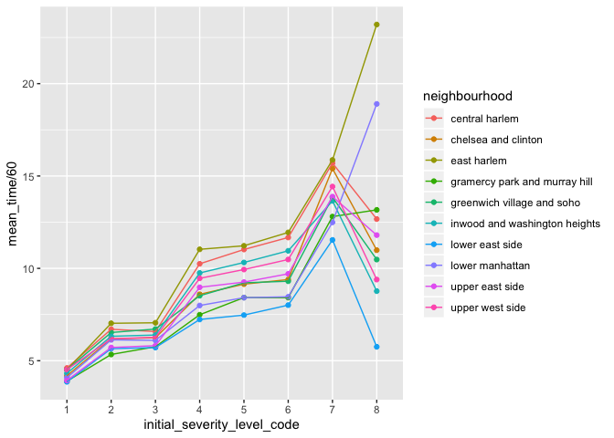

Analysis
================
Bing Bing Guo
11/24/2019

importing and cleaning EMS data in NYC:

``` r
ems_data_clean = read.csv("./data/EMS_Incident_Dispatch_Data.csv") %>%
  select(INITIAL_SEVERITY_LEVEL_CODE, FINAL_SEVERITY_LEVEL_CODE, INITIAL_CALL_TYPE,
         DISPATCH_RESPONSE_SECONDS_QY, INCIDENT_TRAVEL_TM_SECONDS_QY, HELD_INDICATOR, BOROUGH,
         ZIPCODE, INCIDENT_DISPOSITION_CODE, INCIDENT_DATETIME) %>% 
  janitor::clean_names() %>% 
  separate(col = incident_datetime, into = c('date', 'time'), sep = ' ') %>% 
  separate(col = date, into = c("month","day"), sep = '/') %>% 
  mutate(month = factor(month, levels = c("01", "02", "03", "04", "05", "06", "07", "08", "09", "10", "11", "12"), labels = c("Jan", "Feb", "Mar", "Apr", "May", "June", "Jul", "Aug", "Sept", "Oct", "Nov", "Dec"), ordered = TRUE)) %>% 
  mutate(arrival_outcome = ifelse(incident_disposition_code == "83", "dead", "alive"),
         arrival_outcome = recode_factor(arrival_outcome, `0` = "alive", `1` = "dead"),
         initial_severity_level_code = factor(initial_severity_level_code, 
 levels = c("1", "2","3", "4", "5", "6", "7", "8", "9"), ordered = TRUE),
         final_severity_level_code = factor(final_severity_level_code, 
                                            levels = c("1", "2", "3", "4", "5", "6", "7", "8"), ordered = TRUE), 
         held_indicator = recode(held_indicator, "N" = "no", "Y" = "yes")) %>%
  mutate(neighbourhood = recode(zipcode, "10026" = "central harlem", "10027" = "central harlem", "10030" = "central harlem", "10037" = "central harlem", "10039" = "central harlem", "10001" = "chelsea and clinton", "10001" = "chelsea and clinton", "10011" = "chelsea and clinton", "10018" = "chelsea and clinton", "10019" = "chelsea and clinton", "10020" = "chelsea and clinton", "10036" = "chelsea and clinton",  "10029" = "east harlem", "10035" = "east harlem", "10010" = "gramercy park and murray hill", "10016" = "gramercy park and murray hill", "10017" = "gramercy park and murray hill", "10022" = "gramercy park and murray hill", "10012" = "greenwich village and soho", "10013" = "greenwich village and soho", "10014" = "greenwich village and soho", "10004" = "lower manhattan", "10005" = "lower manhattan", "10006" = "lower manhattan", "10007" = "lower manhattan", "10038" = "lower manhattan", "10280" = "lower manhattan", "10002" = "lower east side", "10003" = "lower east side", "10009" = "lower east side", "10021" = "upper east side", "10028" = "upper east side", "10044" = "upper east side", "10065" = "upper east side", "10075" = "upper east side", "10128" = "upper east side", "10023" = "upper west side", "10024" = "upper west side", "10025" = "upper west side", "10031" = "inwood and washington heights", "10032" = "inwood and washington heights", "10033" = "inwood and washington heights", "10034" = "inwood and washington heights", "10040" = "inwood and washington heights" )
  ) %>%  
  drop_na(neighbourhood) %>% 
    select(-incident_disposition_code, -zipcode) 
```

    ## Warning: Expected 2 pieces. Additional pieces discarded in 341372 rows [1,
    ## 2, 3, 4, 5, 6, 7, 8, 9, 10, 11, 12, 13, 14, 15, 16, 17, 18, 19, 20, ...].
    
    ## Warning: Expected 2 pieces. Additional pieces discarded in 341372 rows [1,
    ## 2, 3, 4, 5, 6, 7, 8, 9, 10, 11, 12, 13, 14, 15, 16, 17, 18, 19, 20, ...].

    ## Warning: Unreplaced values treated as NA as .x is not compatible. Please
    ## specify replacements exhaustively or supply .default

FINAL – need to convert to plotly

``` r
ems_data_clean%>%
select(arrival_outcome, neighbourhood, month, borough) %>%
group_by (arrival_outcome, neighbourhood, month, borough) %>% 
drop_na(arrival_outcome) %>% 
summarise_(n_death = ~n()) %>%
filter(arrival_outcome == "dead") %>%
  ggplot(aes(x = month, y = n_death, group = neighbourhood, color = neighbourhood)) + 
  geom_line() + geom_point()
```

    ## Warning: Factor `arrival_outcome` contains implicit NA, consider using
    ## `forcats::fct_explicit_na`

    ## Warning: summarise_() is deprecated. 
    ## Please use summarise() instead
    ## 
    ## The 'programming' vignette or the tidyeval book can help you
    ## to program with summarise() : https://tidyeval.tidyverse.org
    ## This warning is displayed once per session.

<!-- -->

Severity Code by Time, Grouped by Neighborhood

``` r
ems_data_clean%>%
  select(neighbourhood, initial_severity_level_code, incident_travel_tm_seconds_qy) %>%
  group_by(neighbourhood, initial_severity_level_code) %>% 
  summarize(mean_time = mean(incident_travel_tm_seconds_qy)) %>% 
  ggplot(aes(x = initial_severity_level_code, y = mean_time/60, group = neighbourhood, color = neighbourhood)) + geom_point() + geom_line() 
```

<!-- -->

``` r
ems_data_clean %>% 
  select(arrival_outcome, incident_travel_tm_seconds_qy) %>% 
  group_by(arrival_outcome) %>% 
  drop_na(arrival_outcome) %>%
  summarize(mean_time = mean(incident_travel_tm_seconds_qy)) 
```

    ## Warning: Factor `arrival_outcome` contains implicit NA, consider using
    ## `forcats::fct_explicit_na`
    
    ## Warning: Factor `arrival_outcome` contains implicit NA, consider using
    ## `forcats::fct_explicit_na`

    ## # A tibble: 2 x 2
    ##   arrival_outcome mean_time
    ##   <fct>               <dbl>
    ## 1 alive                530.
    ## 2 dead                 295.
